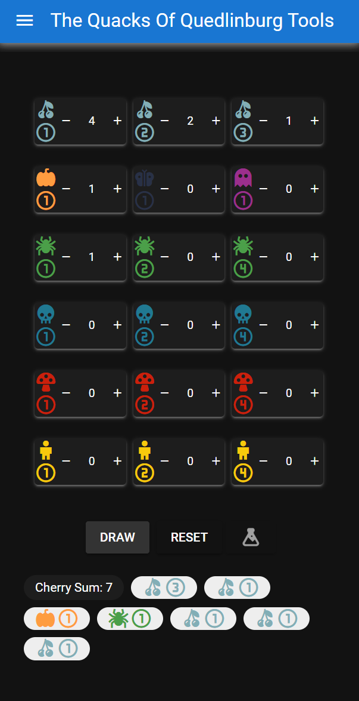
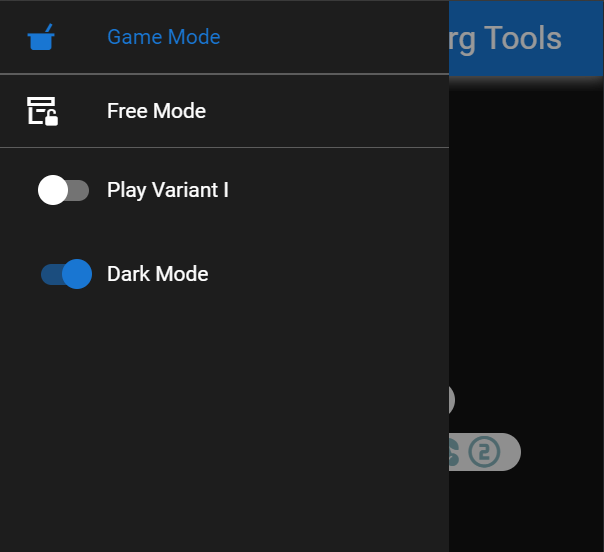
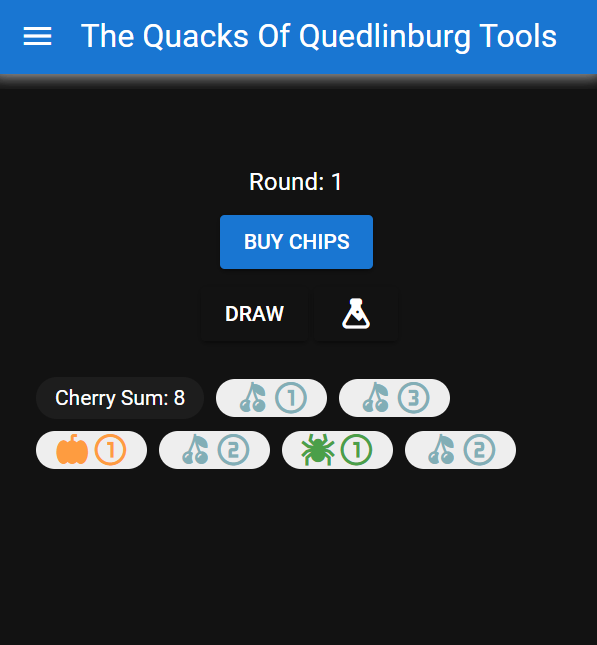
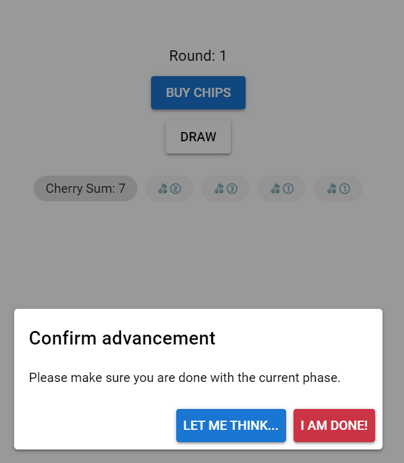
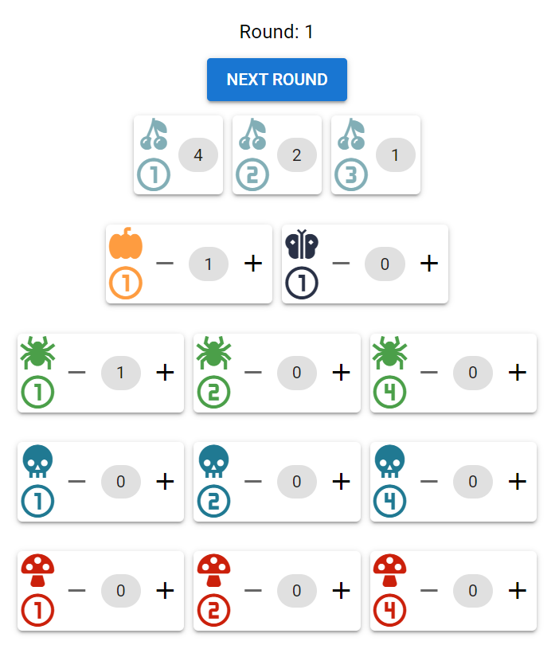
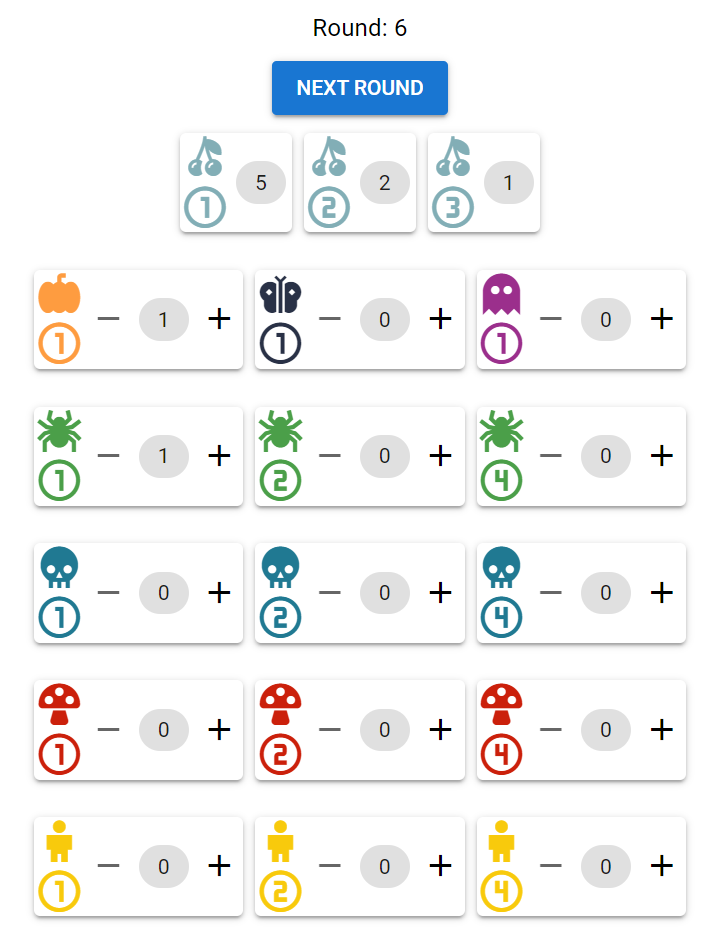
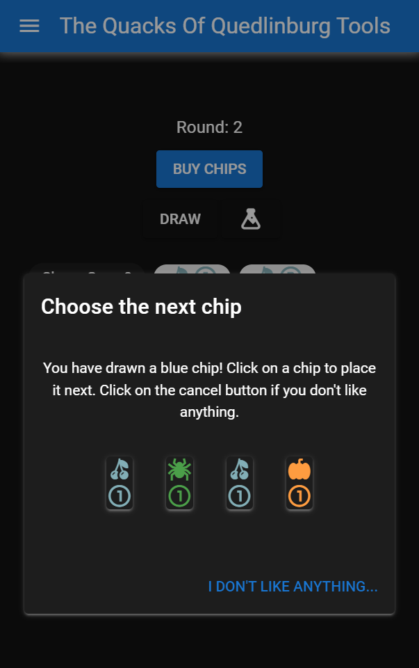

# The Quacks Of Quedlinburg Tools

Out of the box, The Quacks Of Quedlinburg has its core mechanic - random drawing of tokens - completely unusable without frustration. The bags have sharp corners where the tokens get stuck and the cartboard is too light to allow the player to mix properly. This project aims at mitigating those negative effects by providing UI for drawing your tokens, which assures randomness and fairness.

## About the project

The project is developed using Quasar, Vue3 and TypeScript. If you want to work on the codebase, you would need knowledge in all of those.

Currently, only Android is supported, but you could pull the project and build for other platforms.

The release app is not signed. However, the pipeline that builds and publishes it is available within the repository, as well as the full soure code used to build it.

## Features

- Free mode where you can pick any chips you want and draw them.
- Game mode where you go through 9 rounds.
  - On each round you can draw as many chips as you want but you cannot reset.
  - At the end of the round you proceed to the shop, where you can buy maximum 2 chips.
  - You cannot buy two chips of the same type.
  - Chips that are not supposed to be available in the current round are not displayed.
  - You cannot change the quantity of the white chips.
  - One white chip is added automatically on the 6th turn.
  - After the shop phase you have a chance to resolve any card effects that give you tokens.
- Game mechanics support:
  - Flask
  - Drawing blue or yellow in game variation I
- Other
  - Dark mode

## Usage

### Technical

Download the APK file on your phone and install it. You will need to allow installation from unknown sources. Pick a mode. Currently there is game mode and free mode.

### In-Game

Instead of putting your chips in the bag, leave them on the board. Use the app to draw a chip. Then pick the corresponding chip from the pile and place it on your board. When you have to buy chips, use the in-game shop to add them to your bag.

**If you are playing variant I of the game, switch the corresponding toggle in the menu**

### Known limitations

- If you restart the app you will lose your progress.
- If you change the mode you will lose your progress.

## Screenshots

### Free mode

### Side bar

### Game mode

#### Beginning of the game

#### Warning when proceeding

#### Buying phase

#### Buying phase for Round 6

#### Drawing blue when playing variant I

