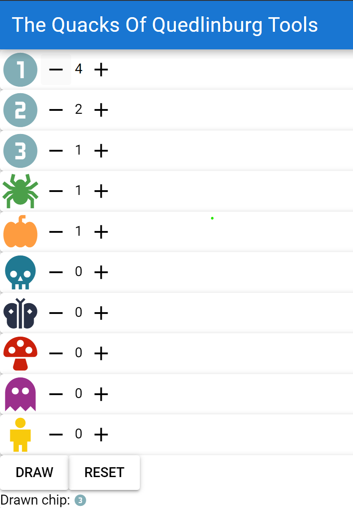

# The Quacks Of Quedlinburg Tools

Out of the box, The Quacks Of Quedlinburg has its core mechanic - random drawing of tokens - completely unusable without frustration. This project aims at drawing providing a basic UI for drawing your tokens, which assures randomness and fairness.

## About the project

The project is developed using Quasar. To use it currently, you would have to jump through hoops to build an .apk file and then upload it to your phone. In the future I will try to add releases to simplify this process, if there is somebody interested in such a tool. In case you want to build it for yourself, check [this documentation](https://quasar.dev/quasar-cli-vite/developing-cordova-apps/build-commands/).

## Code Walkthrough

Most of the project is autogenerated by the Quasar CLI. The code you should be looking at is inside the src/components directory. The token data can be found in src/assets. It is then loaded and visualized. Simple addition and subtraction of tokens is available, as well as a drawing function.

## Screenshots

